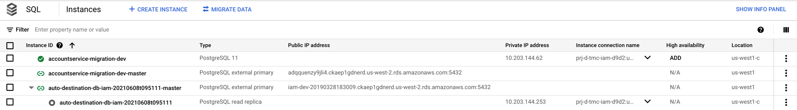

# CloudSQL Migration Scripts

Python script to migrate services from RDS to CloudSQL. Scripts can be run locally or as a helm deployment.

## Installing

Use virtualenv to manage dependencies. This was tested on python 3.9.5.

```bash
python -m virtualenv venv
source venv/bin/activate
pip install -r requirements.txt
```

## Server

TODO: add server docs for integration [with the mig-orch scripts]

### API OBJECTS

#### Task

Fields
- `state`: `running` or `complete` depending if the underlying process is alive
- `createTime`: ISO time when process was created
- `messages`: log output from process
- `ok`: exists only if state == `complete`. `true` means task logic succeeded or `false` if failed. Meaning is specific
  to each particular task type.
- `value` exists only if state == `complete`. A JSON blob, structure and contents vary per task.

Example
```json
{
  "state": "complete",
  "createTime": "2021-09-02T16:50:44.947735",
  "messages": [
    "2021-09-02T16:52:01.650243::WARNING:: failed to connect to postgres iam-dev-20190328183009.ckaep1gdnerd.us-west-2.rds.amazonaws.com/iam",
    "2021-09-02T16:52:01.651452::INFO:: process completed normally"
  ],
  "ok": false,
  "value": {
    "app": "ok",
    "rdsMaster": "failed to connect to db iam-dev-20190328183009.ckaep1gdnerd.us-west-2.rds.amazonaws.com/iam as pgadmin: could not connect to server: Operation timed out\n\tIs the server running on host \"iam-dev-20190328183009.ckaep1gdnerd.us-west-2.rds.amazonaws.com\" (172.16.116.144) and accepting\n\tTCP/IP connections on port 5432?\n",
    "pass": false
  }
}
```

### GetMetadata

See information about the server.

Tasks:
1. preflight - ensure service is ready for migration, creates replication user as well
2. sync - start a migration job and await cdc
3. cutover - promotes migration job
4. cleanup - deletes artifacts associated with a completed migration job

```
GET '/'                    
{"tasks": ["sync", "cutover", "cleanup", "dummy"]}
```

### ListTasks

List running tasks. Include "?completed=true" to include completed tasks as well.

```
GET /tasks?completed=true
[{"state": "running", "createTime": "2021-08-25T20:44:59.425319", "id": "sync/account-service"}]
```

### CreateTask
Creates and starts a task.

```
POST /tasks/{taskName}/{serviceName}
{"state": "started", "id": "sync/account-service"}
```

### GetTask
Get the status of a task

```
GET /tasks/{taskName}/{serviceName}
{
 "state": "running|complete", 
 "messages":[<log messages>]
}
```

Example output
```json
{
  "state": "complete",
  "createTime": "2021-09-02T16:50:44.947735",
  "messages": [
    "2021-09-02T16:52:01.650243::WARNING:: failed to connect to postgres iam-dev-20190328183009.ckaep1gdnerd.us-west-2.rds.amazonaws.com/iam",
    "2021-09-02T16:52:01.651452::INFO:: process completed normally"
  ],
  "ok": false,
  "value": {
    "app": "ok",
    "rdsMaster": "failed to connect to db",
    "pass": false
  }
}
```

### DeleteTask
Delete a task

```
DELETE /tasks/{taskName}/{serviceName}
```

## CLI

### Examples

```bash
python csm.py validate_config iam-dev
# config override with config-<env>.yaml
python csm.py --config=config-dev.yaml validate_config iam

# migration setup function
# <env> = dev, staging, sb1, or prod
# <service> = specify a service name in config-<env>.yaml or default is all 
python csm.py start_sync --config=config-<env>.yaml <service>
python csm.py describe_dms_job --config=config-<env>.yaml <service>
python csm.py promote_dms_job --config=config-<env>.yaml <service>

# To enable debug mode
python csm.py <function> --debug=True
```


## GCP Migration Script Details

The following functions are intended to be run after configuring AWS RDS with functions from <mark>Pre-GCP Migration
Script Details</mark>\
The below functions are all located in **csm.py**.

### validate_config

```bash
# --service <service> flag can be set to a singular service from config-<env>.yaml; else this defaults to "all"
python csm.py validate_config --service <service>
```

### start_sync

```bash
# <service> can be specific service in config-<env>.yaml or <service>="all" to do all services\
# in config-<env>.yaml
python csm.py start_sync --config=config-<env>.yaml <service> 
```

REQUIREMENTS:\
**start_sync** requires corresponding service's AWS RDS to be configured correctly:

- [ ] Each DB has pglogical and rds.logical.replication set in corresponding parameter group:

```bash
 shared_preload_libraries = {
      value        = "pglogical"
      apply_method = "pending-reboot"
    }
 rds.logical_replication = {
      value        = "1"
      apply_method = "pending-reboot"
    }
```

- [ ] Each DB has replication user prior to running **start_sync**\
  If two requirements are not set, then PLEASE READ and follow <mark>Pre-GCP Migration Script Details</mark>

There's two migration strategies: <mark>local</mark> vs <mark>remote</mark> of in context of gcp migration.

- **Local** is for a gcp service connected to Cloudsql postgres instance.
- **remote** is for a gcp service connected to AWS postgres RDS.

#### Local

1. Creates Database Migration Service Job
2. Starts mirroring AWS DB to CloudSQL
3. DMS job in CDC MODE
4. <mark>Creates mirroring CloudSQL secrets in GKE env</mark>
5. Restart GCP service to take in newly created secrets to connect to CloudSQL

#### Remote

1. Creates Database Migration Service Job
2. Starts mirroring AWS DB to CloudSQL
3. DMS job in CDC MODE
4. <mark>Creates AWS RDS secrets in GKE env </mark>
5. Restart GCP service to take in newly created secrets to connect to AWS RDS

#### Verification via GCP Console

If you want to verify if **start_sync** created Cloudsql instance and started mirroring of corresponding AWS RDS:

1. Connection profile creation: https://console.cloud.google.com/dbmigration/connection-profiles?project=<project-name>
   
2. Cloudsql instance creation: https://console.cloud.google.com/sql/instances?project=<project-name>
   
3. Migration job created & started: https://console.cloud.google.com/dbmigration/migrations?project=<project-name>
   

### describe_dms_job

```bash
# <service> can be specific service in config-<env>.yaml or <service>="all" to do all services\
# in config-<env>.yaml
python csm.py describe_dms_job --config=config-<env>.yaml <service>
```

Describes current phase of Database Migration Job and outs a phase status of the migration job.
Reference: https://cloud.google.com/database-migration/docs/reference/rest/v1/projects.locations.migrationJobs#Phase


### promote_dms_job

```bash
# <service> can be specific service in config-<env>.yaml or <service>="all" to do all services\
# in config-<env>.yaml
python csm.py promote_dms_job --config=config-<env>.yaml <service>
```

Promotes target Cloudsql to primary ONLY IF dms job phase == CDC.
**Promote** will pause mirroring and so be mindful when promoting dms jobs. It's equivalent to promoting a target
replica via gcp console.


## References

- [PSO scripts](https://github.com/ArnoldHueteG/migration-rds-to-cloud-sql/blob/master/datamigration_wrapper.py)

